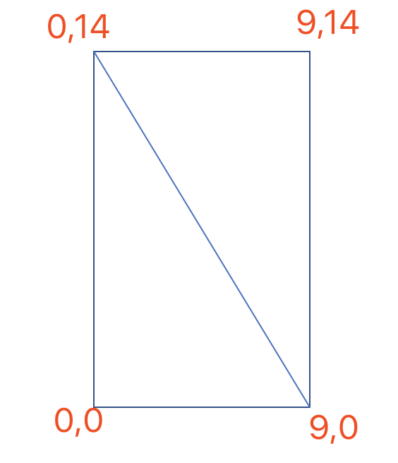
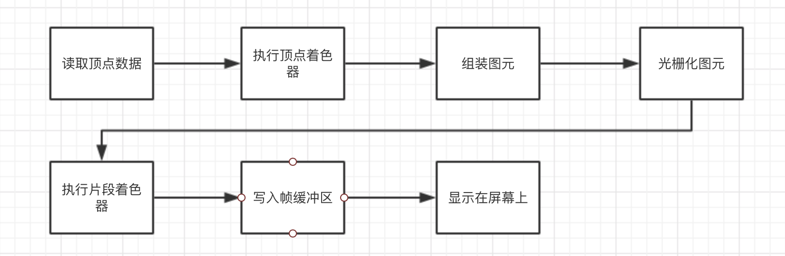

# Day1
## 创建OpenGL应用的主要步骤：
1. 获取系统支持的OpenGLES的版本
2. 为OpenGL ES2.0配置渲染表面（rendering surface）
3. 处理Android Activity生命周期事件
4. 创建渲染Render类

### 1.获取系统支持的OpenGLES的版本
```java
private boolean isSupportOpenGLES2() {
    final ActivityManager activityManager = (ActivityManager) getSystemService(ACTIVITY_SERVICE);
    final ConfigurationInfo configurationInfo = activityManager.getDeviceConfigurationInfo();
    boolean supportsEs2 = configurationInfo.reqGlEsVersion >= 0x20000;
    return supportsEs2;
}
```
### 2.为OpenGL ES2.0配置渲染表面（rendering surface）
```java
if(supportEs2){
    //Request an OpenGL ES 2.0 compatible context.
    //Inform the default EGLContextFactory and default EGLConfigChooser which EGLContext client version to pick. 
    //告诉默认的EGLContextFactory和默认的EGLConfigChooser选择哪个版本的EGLContext client
    glSurfaceView.setEGLContextClientVersion(2);

    //Assign our renderer
    //设置渲染器Render
    glSurfaceView.setRender(new FirstOpenGLProjectRender());

    rendererSet = true;
}else{
    return;
}
```

### 3.处理Android Activity生命周期事件
当Activity显示隐藏时需要处理GLSurfaceView，否则应用就会崩溃。
在步骤2中设置完渲染器后把```rendererSet```设置为true，用来表明GLSurfaceView已经设置完成。
接下来就需要处理Activity生命周期相关的方法。
```java
@override
protected void onPause(){
    super.onPause();
    if(rendererSet){
        glSurfaceView.onPause();//暂停后台渲染线程
    }
}

@override
protected void onResume(){
    super.onResume();
    if(rendererSet){
        glSurfaceView.onResume();//继续后台渲染线程
    }
}
```
### 4.创建渲染Render类
现在要定义一个渲染器，以便开始清空屏幕
定义渲染器Render需要实现Render接口：
1. onSurfaceCreated(GL10 glUnused,EGLConfig config);
当Surface被创建的时候，GLSurfaceView会调用这个方法
2. onSurfaceChanged(GL10 glUnused,int width,int height);
在Surface被创建后，每次surface尺寸变化时，这个方法都会被GLSurfaceView调用。（横竖屏切换，大小变化等）
3. onDrawFrame(GL10 glUnused);
当绘制一帧时，这个方法会被GLSufraceView调用。在这个方法中，我们一定要绘制一些东西，即使只是清空屏幕。因为在这个方法返回后，渲染缓冲区会被交换并显示在屏幕上，如果什么都没画，可能会看到糟糕的闪烁的效果。  

上面参数中GL10，是OpenGL ES1.0的API遗留下来的，如果要编写使用OpenGL ES1.0的渲染器，就要使用这个参数。但是，**对于OpenGL ES2.0，GLES20类提供了静态方法来存取**。

**<font color='red'>在后台线程中渲染</font>**  
GLSurfaceView会在一个单独的线程中调用渲染器的方法。默认情况下，GLSurfaceView会议显示设备的刷新频率不断地渲染，当然，它也可以配置为按请求渲染，只需要用GLSurfaceView.RENDERMODE_WHEN_DIRTY作为参数调用GLSurfaceView.setRenderMode()即可。  
既然Android的GLSurfaceView在后台线程中执行渲染，就必须要小心，只能在这个渲染线程中调用OpenGL，在Android主线程中使用UI相关的调用；两个线程之间的通信可以用如下方法：  
在主线程中的GLSurfaceView实例可以调用queueEvent()方法传递一个Runnable给后台渲染线程，渲染线程可以调用Activity的runOnUIThread()来传递事件给主线程。

```java
public class FirstOpenGLProjectRender implements GLSurfaceView.Renderer {
    @Override
    public void onSurfaceCreated(GL10 gl, EGLConfig config) {
        //设置清空屏幕用的颜色，当屏幕被清空时，就会填充红色
        //前三个参数分别对应红色、绿色、蓝色，最后一个参数为alpha，用来表示般透明度或透明度
        //颜色范围在0-1之间：1最大，0最小
        glClearColor(1.0f, 0.0f, 0.0f, 0.0f);
    }

    @Override
    public void onSurfaceChanged(GL10 gl, int width, int height) {
        //设置视口(viewport)尺寸，告诉OpenGL可以用来渲染的surface的大小
        //set the OpenGL viewport to fill the entire surface
        glViewport(0,0,width,height);
    }

    @Override
    public void onDrawFrame(GL10 gl) {
        //clear the rendering surface
        //清空屏幕，这会擦出屏幕上的所有颜色，并用之前glClearColor()调用定义的颜色填充整个屏幕
        glClear(GL_COLOR_BUFFER_BIT);
    }
}

```
***
# Day2
## 1.在OpenGL里，所有的东西的结构都是从一个定点开始。定点就是一个代表几何对象的拐角点，这个点重要的属性就是位置，代表了这个顶点的在空间中的定位。  
例如：绘制一个长方形，长方形有4个拐角，我们就需要4个顶点。  

## 2.在二维坐标系里，每个顶点有两个分量，一个标记x轴位置，另一个标记y轴位置。  

## 3.**<font color='red'>在OpenGL里，只能绘制点、直线、以及三角形</font>**  

## 4.在定义三角形的时候，我们总是以逆时针的顺序排列顶点；这称为卷曲顺序。如下图：
```java
float[] tableVertices = {
        //Triangle1
        0f, 0f,
        9f, 14f,
        0f, 14f,
        //Triangle2
        0f, 0f,
        9f, 0f,
        9f, 14f
};
```
   
在任何地方都使用这种一致的卷曲顺序，可以优化性能。使用卷曲顺序可以指出一个三角形属于任何给定物体的前面或者后面，OpenGL可以忽略那些无论如何都无法被看到的后面的三角形。（？？没懂）

## 5.OpenGL作为本地系统库直接运行在硬件上，没有虚拟机。java代码运行在虚拟机中，所有java代码需要和OpenGL通信。通信方式有：
    1. JNI。当调用android.opengl.GLES20包里的方法时，软件开发包实际上就是在后台使用JNI调用本地系统库
    2. 把内存从java堆复制到本地堆

## 6.在绘制到屏幕上之前，需要在OpenGL的管道（pipeline）中传递，这就需要使用称为着色器（shader）的子例程。这些着色器会告诉图形处理单元（GPU）如何绘制数据。**<font color='red'>有两种类型的着色器（顶点着色器，片段着色器），在绘制任何内容到屏幕之前，需要定义他们。</font>**

* 顶点着色器（vertex shader）：生成每个顶点的最终位置，针对每个顶点，它都会执行一次。一旦最终位置确定了，OpenGL就可以把这些可见顶点的集合组装成点、直线以及三角形。
* 片段着色器（fragment shader）：为组成点、直线或者三角形的每个片段生成最终的颜色，针对每个片段，它都会执行一次。一个片段是一个小的、单一颜色的长方形区域，类似于计算机屏幕上的一个像素。  
一旦最后的颜色生成了，OpenGL就会把他们写到一块称为帧缓冲区（frame buffer）的内存块中，然后，Android会把这个帧缓冲区显示到屏幕上。
处理过程如下图：

### 1.创建顶点着色器
着色器一般存放在raw/目录下，以.glsl后缀结尾。
```c
attribute vec4 a_Position;
void main(){
    gl_Position = a_Position;
}
```
对于我们定义过的每一顶点，顶点着色器都会被调用一次。当它被调用的时候，它会在a_Position属性里接受当前顶点的位置，这个属性被定义成vec4类型。  
一个vec4是包含4个分量的向量。在位置的上下文中，可以认为这4个分量是x、y、z和w坐标，x、y和z对应一个三维位置，而w是一个特俗的坐标。如果没有指定，默认情况下OpenGL都是把向量的前3个坐标设为0，并把最后一个坐标设为1.  
一个顶点会有几个属性，比如颜色/位置，关键词attribute就是把这些属性放进着色器的手段。  
之后，可以定义main()，这是着色器的主要入口点。它所做的就是把前面定义过的位置复制到输出变量gl_Position。这个着色器一定要给gl_Position赋值。OpenGL会把gl_Position中存储的值作为当前顶点的最终位置，并把这些顶点组装成点、直线、和三角形。

### 2.创建片段着色器
OpenGL通过“光栅化”的过程把每个点、直线及三角形分解成大量的小片段，它们可以映射到移动设备显示屏的像素上，从而生成一幅图像。这些片段类似于显示屏上的像素。为了表示颜色，每个片段都有4个分量：其中红色、绿色、蓝色用来标示颜色，alpha分量用来标示透明度。
```c
precision mediump float;
uniform vec4 u_Color;
void main(){
    gl_FragColor = u_Color;
}
```
片段着色器的主要目的就是告诉GPU每个片段的最终颜色应该是什么。对于基本图元（点、直线、三角形）的每个片段，片段着色器都会被调用一次。  
在这个片段着色器中，文件顶部的第一行代码定义了所有浮点数据类型的默认精度。可以选择lowp、mediump、highp，它们分别对应低精度、中等精度、高精度。  
为什么顶点着色器没有定义精度呢？顶点着色器同样可以改变其磨人精读，但是对于一个顶点的位置而言，精确度是最重要的，OpenGL设计者决定把顶点着色器的精确度默认设置为最高级-highp。  
高精度数据类型更加精确，但是这是以降低性能为代价的。对于片段着色器，处于最大兼容性的考虑，选择了mediump。  

这个片段着色器需要传递一个uniform，它叫做u_Color。它不像属性，每个顶点都要设置一个。一个uniform会让每个顶点都使用同一个值，除非我们再次改变它。u_Color也是一个四分量向量，但在颜色的上下文中，这四个分量分别对应红色、绿色、蓝色、和阿尔法。  
接着我们定义了main()，它是这个着色器的主入口点，它把我们在uniform里定义的颜色复制到那个特殊的输出变量--gl_FragColor。着色器一定要给gl_FragColor赋值，OpenGL会使用这个颜色为当前片段的最终颜色。

OpenGL中基本的颜色值被限定在范围[0,1]内，0代表缺少这个特定的基本颜色，而1代表那个颜色的最大强度。